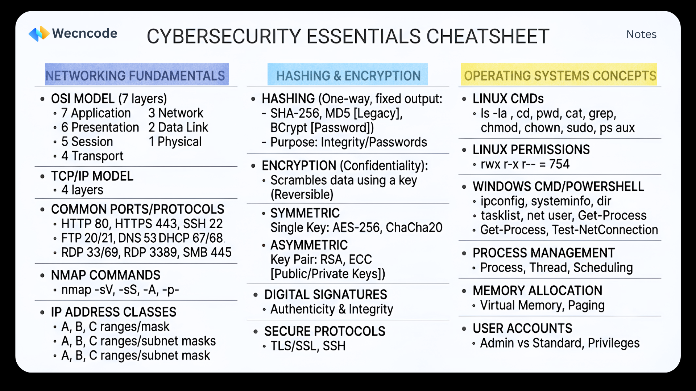

# Offensive & Defensive Cybersecurity Cheatsheets

A curated, zero-fluff reference guide for penetration testers, CTF competitors, and cybersecurity students.

When you are in the middle of a time-constrained engagement, lab, or certification exam (such as OSCP, eJPT, or Security+), parsing through lengthy documentation breaks your momentum. This repository provides exact commands, syntax examples, and core methodologies at a glance.

## Repository Structure

The cheatsheets are categorized into core cybersecurity domains for rapid navigation.
#### 1. Networking-Fundamentals
<ul> 
  <li>Nmap Scanning - Host discovery, aggressive scanning, and NSE scripts.
  <li>Common Ports & Protocols - Target services and their common exploitation vectors.
  <li>Wireshark Filters - Isolating malware beacons, cleartext credentials, and recon traffic.
</ul>
2. Operating Systems
<ul>
  <li>Linux Commands & PrivEsc - SUID binaries, Cron jobs, and system enumeration.
  <li>Windows AD Basics - Active Directory enumeration, LotL tactics, and PowerShell cmdlets.
  <li>iOS Admin & Security - MDM profiles, libimobiledevice, and jailbreak runtime analysis.
</ul>

#### 3. Cryptography & Hashes
<ul>
   <li>Hashcat & Password Cracking - Attack modes, masks, and hash identification.
   <li>Encoding vs. Encryption - Base64, URL encoding, symmetric/asymmetric encryption, and hashing principles.
</ul>

## Getting Started

### Option 1: Local Clone (Recommended)
Keep a local copy on your attack machine (Kali Linux, Parrot OS, Commando VM) to ensure you have access to your notes even in offline exam environments.

``
git clone https://github.com/Wecncode/Cybersecurity-Cheatsheets.git
``
 

``
cd Cybersecurity-Cheatsheets
``

Use terminal utilities like grep to quickly find syntax on the fly:

` 
Example: Quickly finding the Nmap syntax for a UDP scan
`
 
`
grep -i "UDP" Networking-Fundamentals/Network-Ports-Protocols.md
`

## Option 2: Web Viewing
Simply bookmark this repository and use GitHub's native Markdown rendering to read the tables and copy commands directly to your clipboard.

## Why Use This Repo?
Action-Oriented: We prioritize commands over theory. If it doesn't help you type a command or understand a vulnerability path, it's not here.

CTF & Exam Focused: Tailored for the specific challenges found on platforms like HackTheBox, TryHackMe, and OffSec labs.

Living Document: Constantly updated with modern LotL techniques and new tool syntax.

## Contributing
Cybersecurity thrives on knowledge sharing. If you have a favorite command, a new tool, or an exploit path that isn't documented here, we welcome your contributions!

- Fork the Project.
- Create your Feature Branch (git checkout -b feature/AmazingCheatsheet).
- Commit your Changes (git commit -m 'Add some AmazingCheatsheet').
- Push to the Branch (git push origin feature/AmazingCheatsheet).
- Open a Pull Request.

## Legal Disclaimer
For Educational and Authorized Testing Purposes Only.

The scripts, commands, and methodologies detailed in this repository are intended strictly for educational purposes, authorized penetration testing, and defensive security research. You are responsible for your own actions. Never utilize these tools or techniques against systems, networks, or applications for which you do not have explicit, written permission from the owner.

*Created with 🩶 by Wecncode Developer Community!*
